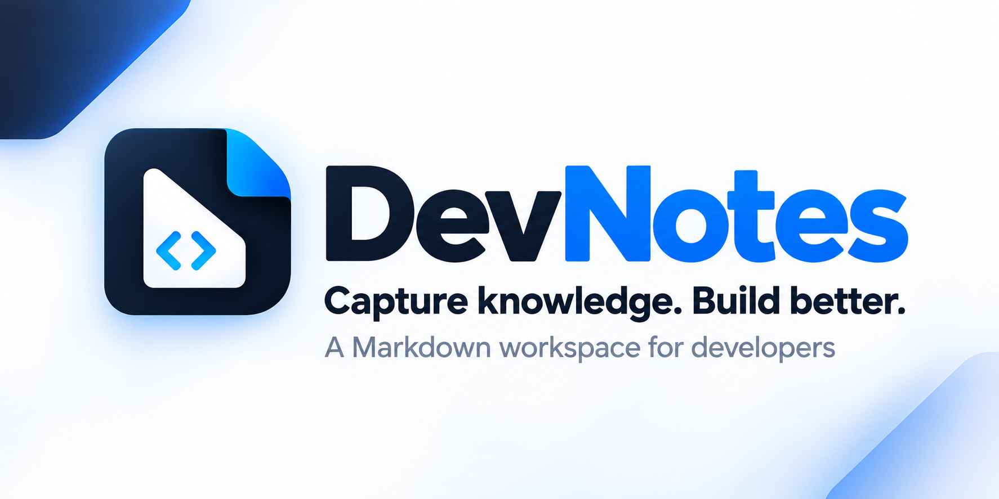
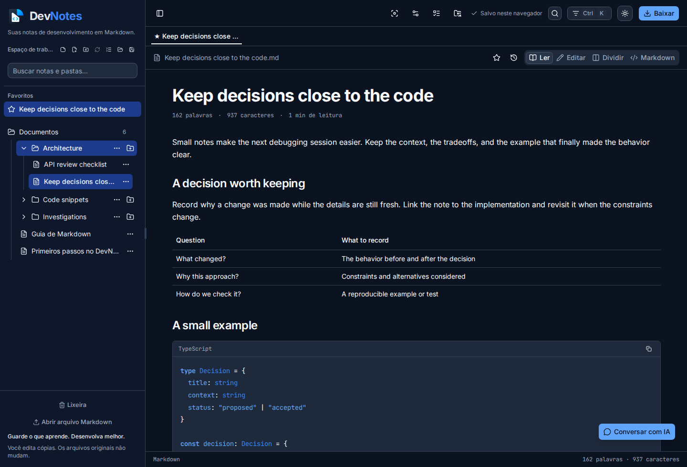
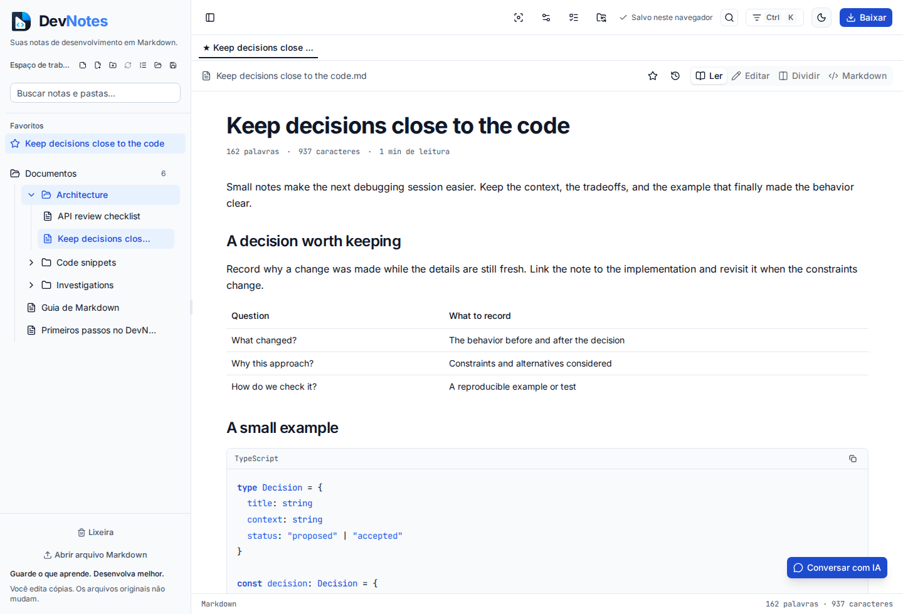

<p align="center">
  
</p>

<h1 align="center">DevNotes</h1>

<p align="center">A Markdown workspace for the notes you write while building software.</p>

<p align="center">
  <a href="https://github.com/thiagocorreanet/dev-notes/actions/workflows/ci.yml"></a>
  <a href="https://nodejs.org/"></a>
  <a href="https://www.typescriptlang.org/"></a>
</p>

<p align="center">
  <a href="#get-started">Get started</a> ·
  <a href="#features">Features</a> ·
  <a href="docs/guide.md">User guide</a> ·
  <a href="CONTRIBUTING.md">Contributing</a> ·
  <a href="https://github.com/thiagocorreanet/dev-notes/issues">Report a bug</a>
</p>

Keep debugging notes, code snippets, and architecture decisions in one place. DevNotes runs in your browser, with a folder tree, visual editing, and direct access to Markdown source. On Linux, you can register it as your Markdown application: double-click a `.md` file, edit it in a browser tab, and save it back to disk.

The interface is in Brazilian Portuguese. Documentation and code use English; your documents keep the language you write them in. The browser workspace requires no account and stores notes on your device. AI chat is optional and connects to a server you configure.

## A look inside



<details>
<summary>Light theme</summary>



</details>

These are screenshots of the running application with sample notes. The [identity board](docs/assets/devnotes-identity-board.png) documents the brand direction; its interface sketches are design references.

## Features

### Write visually or edit the source

Switch between reading, visual editing, Markdown source, and a split preview. The visual editor supports headings, tables, checklists, images, and code blocks. Documents that cannot be converted safely remain available in the source editor. Opening visual mode alone does not rewrite a file.

Select text in reading or visual-editing mode to add a yellow, green, blue, or pink visual highlight. Highlights are stored as browser metadata and never add markup to the Markdown file.

### Organize notes around your projects

Create nested folders, keep several documents open in tabs, and pin favorites. When creating a folder, choose a matching location on the computer to create and connect it, or keep it only in the browser. The selected workspace folder remains its parent, so a directory created inside `docs` appears as `docs/child` in the sidebar. Existing workspace folders can be saved to a chosen computer location from their item menu. The sidebar shows standalone files and the actual folders you open, without adding a synthetic root folder. Search titles, document content, and folder paths. Rename, move, or duplicate workspace items from their menus. Deleted notes go to the trash, and document history lets you compare and restore earlier versions.

### Open files from Linux

Double-click a Markdown file to open DevNotes in your default browser. A small local Node.js service serves the application and reads only files authorized through the launcher. An explicit file or folder opening replaces the previous tab set, while the saved browser workspace remains available in the sidebar. Saving checks for external changes before writing to the original. Dropped files and ordinary browser imports open as copies.

### Find commands without leaving the document

Press `Ctrl/Cmd+K` to search documents and editor actions. Use `Ctrl/Cmd+F` to find text in the current document, or open the minimap to jump between headings. The selected section is briefly marked, and reading positions are remembered when you return.

### Read with fewer distractions

Focus mode hides the sidebar and secondary tools while keeping the editor mounted. Escape restores the workspace. Choose a light or dark theme, document width, text size, and animation preference. Settings persist, and the interface respects the system's reduced-motion setting.

### Keep technical details readable

Preview Mermaid diagrams, copy syntax-highlighted code, and link related notes with wiki links. Templates help you start an architecture decision, bug investigation, or meeting note. The task dashboard collects Markdown checklists across the workspace and lets you update them in place.

### Present and export

Turn document headings into slides or print the active page to PDF. Download individual Markdown files whenever you want a portable copy.

### Ask questions about your notes

Connect a Chat Completions-compatible server, choose a model, and open the built-in chat. You decide whether to include the current document. API keys and conversations stay in page memory, and chat responses never modify your notes automatically. The chosen server must permit browser requests through CORS.

## Get started

Use Node.js 24 and npm 11 or later. If you use nvm, `nvm use` selects the version in `.nvmrc`.

```bash
git clone https://github.com/thiagocorreanet/dev-notes.git
cd dev-notes
npm ci
npm run dev
```

Open the address printed by Vite, usually `http://localhost:5173`.

### Install the Linux file association

After installing the dependencies, run:

```bash
npm run local:install -- --default
```

This builds the app and registers DevNotes as the default Markdown application for your Linux user. Omit `--default` to add it to the file manager's Open With menu without changing the default.

Double-click a `.md` or `.markdown` file. The launcher starts a background service and opens a URL like this:

```text
http://127.0.0.1:45164/?ws=1&file=/home/you/notes/debugging.md
```

The installer references this checkout and your current Node executable. Keep both in place, and reinstall after moving them. There is no standalone binary installer yet.

To launch a document without registering a file association:

```bash
npm run build
npm run local:open -- "/absolute/path/to/note.md"
```

To stop the service or remove the Linux integration:

```bash
npm run local:stop
npm run local:uninstall
```

Uninstalling keeps your documents and checkout. See the [local launcher guide](docs/guide.md#open-markdown-files-from-the-computer) for ports, file limits, and save behavior.

## Where your work is saved

| How you open a document                      | Where changes go                                                                                       |
| -------------------------------------------- | ------------------------------------------------------------------------------------------------------ |
| Browser workspace                            | Saved pages and folders persist in this browser and origin. Temporary documents need an explicit save. |
| File picker, folder import, or drag and drop | DevNotes edits a workspace copy. Download it to keep a separate Markdown file.                         |
| Linux file association or local launcher     | Save and `Ctrl/Cmd+S` write to the original file. Unsaved edits have browser recovery snapshots.       |
| Connected local folder                       | Explicit folder-save actions write to disk. Manual scans detect external changes and report conflicts. |

Clearing browser data removes the browser workspace, preferences, and recovery snapshots. Download important notes separately. Connected-folder access requires a browser with the directory picker API; other browsers can still import files and download Markdown copies.

The standard web app has no cloud synchronization. Optional AI requests go to the endpoint you configure. The local file service binds to `127.0.0.1` and is intended for your own computer.

## Save destinations

The save-destination strip identifies original files, imported copies, connected folders, and temporary documents. It explains whether Save writes to the original or stores the document in this browser. Connected files keep their separate explicit folder-save action.

## Keyboard shortcuts

| Shortcut                         | Action                                                     |
| -------------------------------- | ---------------------------------------------------------- |
| `Ctrl/Cmd+K`                     | Search documents and commands                              |
| `Ctrl/Cmd+F`                     | Find in the active document                                |
| `Ctrl/Cmd+S`                     | Save the active page or launched original file             |
| `Ctrl/Cmd+B`                     | Toggle the sidebar                                         |
| `Escape`                         | Dismiss the active dialog or leave focus/presentation mode |
| `/` in a visual-editor paragraph | Open formatting and insertion commands                     |

## Development

DevNotes uses React, strict TypeScript, and Vite. Interface controls come from official shadcn/ui components with the Nova preset. Tiptap handles visual editing; react-markdown and remark-gfm render Markdown; Mermaid renders diagrams. The Linux launcher uses Node.js built-ins.

```bash
npm run check          # Formatting, lint, tests, types, and production build
npm test               # Watch mode for editor tests
npm run test:local     # Local HTTP and filesystem tests
npm run build          # Production files in dist/
```

GitHub Actions runs these checks for pushes and pull requests, followed by browser workflows in Chromium and Firefox. For a web deployment, host `dist/` on a static host with HTTPS. The optional local file service should remain on the user's computer.

```text
src/components/ui/    Official shadcn/ui components
src/features/notes/   Editor, workspace state, file workflows, and tests
src/styles/           Semantic theme tokens and document styles
scripts/local/        Linux launcher, file service, and installer
public/               Application icon
docs/                User guide and brand assets
```

The [user guide](docs/guide.md) covers editing, storage limits, local-folder conflicts, AI configuration, and deployment. [AGENTS.md](AGENTS.md) records the code and interface conventions.

## Contributing

Bug reports, documentation fixes, and pull requests are welcome. Include a small Markdown example when reporting an editing issue, along with your browser and how you opened the document. For substantial changes, open an issue first so the behavior can be discussed before implementation.

Read [CONTRIBUTING.md](CONTRIBUTING.md) for setup, validation, and UI conventions.

## Releases and repository automation

The [Release workflow](https://github.com/thiagocorreanet/dev-notes/actions/workflows/release.yml) prepares web and Linux archives with checksums. Pushing a tag that matches the package version creates a draft release after all checks pass. A manual run builds downloadable artifacts without publishing a release. The Linux package includes the compiled app and requires Node.js 24.

Bug report forms collect browser and operating system information, which the issue workflow uses to apply labels. See the [automation guide](docs/automation.md) for browser tests, release steps, and workflow permissions.

## Visual identity

The DevNotes identity uses blue and navy, with Inter for interface text and JetBrains Mono for code. The document/code mark is available as an [SVG](public/devnotes-icon.svg). The [brand assets guide](docs/brand.md) includes the supplied identity board, generated cover, and image provenance.

## License

A project license has not been selected yet. Dependency licenses remain with their respective authors.
