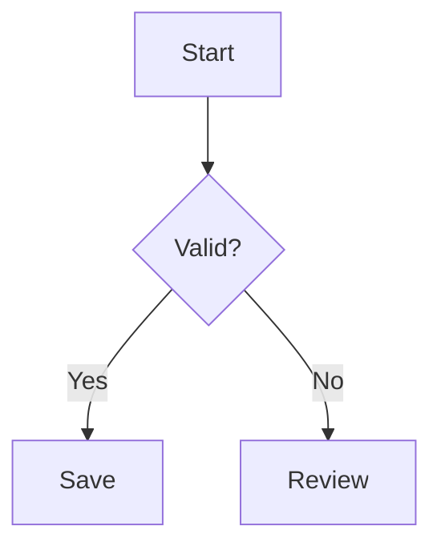

# DevNotes user guide

[Back to the project overview](../README.md)

This guide describes the editor, file workflows, and storage behavior. Action names are translated into English throughout this guide; the application interface uses Brazilian Portuguese.

## Run locally

Use Node.js 24 and npm 11 or later. The Node.js major version is pinned in `.nvmrc`.

```bash
nvm use # Optional when using nvm.
npm ci
npm run dev
```

Open the address printed by Vite, usually `http://localhost:5173`.

## Open documents from the computer

DevNotes can open in the **default web browser** when a Markdown or PDF file is activated in the Linux file manager. The React/TypeScript/shadcn interface is reused; no Tauri, Electron, desktop window, or development server is involved. A Node.js 24 process serves the production build and accesses explicitly opened files on the same computer.

```bash
# Build and register DevNotes as the default Markdown application for this Linux user.
npm run local:install -- --default

# Alternatively, build and launch without installing file associations.
npm run build
npm run local:open -- "/absolute/path/to/document.md"
```

The installer registers `.md`, `.markdown`, `.pdf`, and folder MIME handlers through a per-user desktop entry. DevNotes appears in **Open With** for every supported format and for folders. The `--default` option changes only the Markdown defaults; the installer never replaces the default PDF viewer. The installed launcher references this checkout and the current Node executable: keep both in place and reinstall after moving them. This is a local checkout installation, not a standalone distributable installer. File association installation currently supports Linux; other systems can use the CLI but do not yet have association installers.

Opening a file starts the local service if necessary, then opens a browser page at:

```text
http://127.0.0.1:45164/?ws=1&file=/absolute/path/to/document.md
```

The path is URL-encoded by the launcher, including spaces, accents, `&`, and `#`. `ws=1` selects the local opening flow; it does not import the entire containing folder. Each file activation opens a browser page and reuses the same background service. The service stays running until stopped or the computer restarts. The next activation starts it again automatically. Only `127.0.0.1` is bound; no network interface is exposed.

- For Markdown, **Save original file** and **Ctrl/Cmd+S** write the launched document back to its original path. Edits are written to the original only when explicitly saved; recovery snapshots stay in browser storage, and the browser warns before leaving with unsaved edits. Reloading reads the file from disk and offers any recoverable draft. Download and Save as retain their existing copy-download behavior.
- PDFs are read-only. Page navigation, zoom, refresh, and download remain available, while editing, saving, history, protection, presentation, and attaching the current document to Codex are disabled.
- The title/content split preserves the original Markdown prefix and line endings when the title is unchanged. Saving an unchanged document preserves its exact UTF-8 content, including files without a leading heading. Changing the title updates the document heading, not the filename.
- Saves check the disk version and refuse competing external edits. The editor retains the unsaved version and explains how to download it or reload the original with the existing Refresh file action. Writes use a temporary file in the destination directory, synchronize it, preserve permission bits, recheck the disk version, and rename it into place. Write permission on the containing directory is required. Metadata such as extended attributes and hard-link identity is not preserved. There is no cross-process compare-and-swap guarantee against another program writing at the final rename boundary.
- Files must be regular files. UTF-8 Markdown is limited to 2 MB; a PDF is limited to 50 MB and must contain a PDF signature near the start of the file. Authorization is limited to files opened through the launcher. Entering an arbitrary filesystem path in a URL does not authorize it. A one-use launch ticket establishes an HttpOnly, SameSite session cookie and redirects to the `ws`/`file` URL. The service validates Host/Origin and rejects cross-site requests. Launcher credentials are stored in the user's private state directory, outside the web build.
- Ordinary browser workspace notes and connected-folder workflows keep their existing behavior. Workspace rename, move, trash, and export actions do not manipulate the launched file on disk. Relative images and links retain the existing browser renderer behavior; the service does not expose the containing directory as a file server.

The default port is **45164**, deliberately separate from other local editors. Use `npm run local:open -- --port=45165 "/path/document.md"` to select another port when starting a service. An already-running service keeps its port. Changing ports changes the browser storage origin, so use a stable port to retain the same browser workspace. The port does not affect Markdown content stored on disk.

```bash
npm run local:stop
npm run local:uninstall
```

Uninstall removes the desktop handler and restores recorded previous defaults when DevNotes is still selected. It keeps documents, browser storage, and the checkout. Stop the server separately before uninstalling. Service state and logs are under `$XDG_STATE_HOME/devnotes` or `~/.local/state/devnotes`. `DEVNOTES_STATE_DIR` provides an isolated state directory for testing. `--no-browser` prints short-lived launch links for browser testing; treat those links as local access credentials.

## Folder workspaces

A folder workspace keeps every document in a folder on the computer instead of browser storage. The sidebar is built from that folder, so its hierarchy always matches the one in the file manager. Folder workspaces need the local launcher, because the local service performs the disk operations.

Open one in any of these ways:

- Run `devnotes /absolute/path/to/folder` or `npm run local:open -- "/absolute/path/to/folder"`. The launcher opens `http://127.0.0.1:45164/?ws=1&workspace=<id>`, where the id is a random value bound to your browser session.
- Choose DevNotes in the file manager's **Open With** menu for a folder.
- In a page opened through the launcher, use **Switch workspace** at the top of the sidebar. **Open a folder as workspace** and **Create a workspace folder** show the desktop's folder dialog (zenity or kdialog); the person chooses the folder, not the page. **Copy documents from this browser to a folder** writes the browser workspace, including nested folders, favorites, document history, and encrypted documents, into a new folder and opens it. The browser workspace itself is kept. **Use the browser workspace** returns to browser storage.

How the folder is used:

- Markdown files (`.md`, `.markdown`) appear as documents and subfolders as folders, including empty ones. PDFs appear read-only. Hidden entries, `node_modules`, symbolic links, and other file types are ignored and never modified by DevNotes. Limits match connected folders: 10,000 entries, 2 MB per Markdown file, and 20 MB of Markdown in total.
- Edits are written to the file automatically about half a second after typing stops, and **Save page** or Ctrl/Cmd+S writes immediately. Text before the document content, such as the title heading, and the original line endings are preserved. The browser warns before leaving while a write is pending.
- **New page** creates a Markdown file in the selected folder, named after the title with accents and spaces kept; characters that filenames cannot contain become hyphens, and repeated names receive a number. **New folder** creates the directory inside the selected folder. Renaming a page renames its file and updates its heading; renaming or moving a folder renames or moves the directory with everything inside it, including files DevNotes does not show. A move is refused when the destination already has an item with that name.
- **Duplicate** copies the file or the entire directory. Links between documents inside a duplicated folder point to the copies.
- **Move to trash** moves the item into `.devnotes/trash`. Restoring puts it back at its original path, recreating missing parent folders and adding a number when the name is taken. Deleting permanently removes it from the trash.
- `.devnotes/workspace.json` maps file paths to stable document identifiers, so tabs, links, highlights, reading positions, and favorites survive moves and renames made inside DevNotes. Items moved by another program receive new identifiers. Folder protection is recorded there as well. `.devnotes/history` stores up to 30 earlier versions per document. Protected documents keep their history inside the encrypted envelope, and protecting a document deletes its readable history file. If the folder is a Git repository, decide whether to commit or ignore `.devnotes`.
- DevNotes rereads the folder when its window regains focus and when you use **Reload folder**. Files changed elsewhere load automatically when you have no unsaved edits in them. If a file changed while you were editing it, or disappeared, DevNotes stops writing that document and asks whether to keep your version or use the folder's version; the version you give up stays in the document history. Two DevNotes pages editing the same folder can overwrite each other's `.devnotes` metadata.
- Each folder remembers its open tabs in this browser. Imports, dropped files, and **Open document** add copies of Markdown files to the workspace folder.

Security: the page can reach only folders that were opened through the launcher or chosen in the desktop folder dialog, and only through the session that opened them. Every request carries the workspace id, paths are checked segment by segment, writes cannot leave the folder through `..` or symbolic links, and only the trash and history inside `.devnotes` can be deleted.

## Interface motion

Motion uses the existing shadcn/ui Nova components and `tw-animate-css`; no additional animation library is required. The official shadcn MCP was consulted for `collapsible-demo`, `skeleton-demo`, and `button-loading`. Spinner was installed with `npx shadcn@latest add spinner`.

- Sidebar folders animate their measured height and rotate their chevrons. New document tabs, document/view changes, and presentation slides have short opacity transitions.
- Opening a file through the local launcher shows an accessible Skeleton composition until the real document arrives. The document region reports its loading state and does not flash an example document.
- Explicit saves show a Spinner while pending. Success appears only after persistence succeeds, resets after 2.2 seconds, and stops applying as soon as the document changes. Failures retain the error and the unsaved document.
- Theme changes transition semantic colors for 180 ms. Code-copy confirmation animates briefly and resets after 2.2 seconds.
- Animations and transitions are disabled for `prefers-reduced-motion: reduce` and printing. Minimap navigation also uses immediate scrolling when reduced motion is enabled. Document typing does not restart the entry animation.

## Focus, reading preferences, and recovery

Use **Focus mode** in the header or **Toggle focus mode** in the command palette to hide the sidebar, document tabs, secondary actions, and AI chat. Search, view selection, saving, and the exit control stay available. **Escape** leaves focus mode after any open dialog has been dismissed. The editable document stays mounted and retains its text and editing state. The sidebar returns to its previous width and expanded/collapsed state.

**Appearance preferences** is available in the header and command palette. Choose 14, 16, 18, or 20 px document text, comfortable/wide/full document width, a light/dark theme, and whether to animate the interface. Settings apply immediately, persist per browser origin, and synchronize between open tabs. Inter remains the document/UI font and JetBrains Mono remains the source-code font. Split view uses the available width for its two columns. Focus mode constrains otherwise full-width documents for reading. The system's reduced-motion preference always takes precedence over the animation switch. Preference storage failures are reported in the settings dialog.

Drop `.md`, `.markdown`, or `.pdf` files anywhere over the app. Markdown opens as browser workspace copies; PDFs open read-only for the current page session and are not written to browser storage. A shadcn Card identifies the drop target, and the browser's normal file-navigation behavior is prevented. The whole batch is validated before import: at most 100 files, 2 MB per Markdown file, 20 MB of Markdown total, 50 MB per PDF, and 100 MB of PDFs total. Unsupported or invalid files reject the batch without replacing the open document. Dropped files do not grant the local service access to their original paths and are never written back implicitly. Use the existing computer file association to edit a Markdown original, or use Download/Save as for a copy. The file picker remains available for keyboard and touch users.

Unsaved documents opened through the local launcher keep recovery snapshots in browser storage. On reopening, DevNotes offers **Recover draft** or **Discard this draft** before editing continues. Recovery never writes to disk automatically. Each editing session has its own snapshot key so concurrent tabs do not overwrite one another's recovery records. Restoring a snapshot retains its original disk version, so external changes still produce a save conflict. Saving successfully clears that session's recovery record. If the original is missing or the service is unavailable, a stored snapshot can still be recovered for downloading; original-file saves still require file access. Storage failures warn the user to save or download before leaving. Clearing browser data removes recovery records. Temporary new documents retain their existing explicit-save behavior.

Reading positions are remembered independently for each document in Read and Split views. The app stores the nearest heading and offset, with a pixel fallback if the heading no longer exists. It briefly adjusts for asynchronous content layout, then stops adjusting when the reader interacts. Explicit minimap navigation takes priority over position restoration. The selected heading receives a temporary semantic-color outline/background, including a static highlight when animation is disabled.

These controls use official shadcn/ui Dialog, Select, Switch, Alert, Button, and Card compositions. The MCP examples `switch-demo`, `select-demo`, and `dialog-demo` were consulted, and Switch was installed with `npx shadcn@latest add switch`.

## Workspace

On desktop, drag the divider between the sidebar and the document to adjust the sidebar width. The divider uses the official shadcn/ui Resizable component: it supports mouse and touch input, keyboard arrows when focused, and a double-click to restore the default width. Width is constrained to 260 to 480 px while reserving at least 360 px for the document. The preferred width is saved locally and restored when reopening the sidebar or reloading the app. Browser storage failures do not prevent resizing. On mobile, the sidebar continues to open as a sheet.

The sidebar toolbar provides document and folder actions using official shadcn/ui buttons and tooltips. The descriptions below use English; their interface labels appear in Brazilian Portuguese:

| Action             | Behavior                                                                                                  |
| ------------------ | --------------------------------------------------------------------------------------------------------- |
| New document       | Open a blank temporary document in Edit mode. Use Save page to keep it in the browser.                    |
| New workspace page | Create a named page in the selected folder and save it in this browser.                                   |
| New folder         | Enter a name, then choose a computer location or keep the folder only in the browser.                     |
| Refresh file       | Reload an imported Markdown or PDF file from its source. Confirm before replacing local Markdown edits.   |
| Collapse all       | Close every folder, including nested folders, and clear the search so the collapsed tree remains visible. |
| Open folder        | Import a local folder's hierarchy and supported Markdown and PDF files.                                   |

Use **Open document** in the sidebar footer or command palette to open a `.md`, `.markdown`, or `.pdf` document. Opening a file, a dropped batch, an imported folder, or a connected folder replaces the current document tabs with the requested selection. Existing browser workspace documents remain saved and available in the sidebar. A document opened through the Linux launcher also ignores restored workspace tabs for that browser page.

The sidebar shows standalone documents and explicitly opened folders at the top level, without a synthetic Documents folder. When nothing is open, it offers direct actions for choosing a Markdown file or folder. Nested folders use indentation and guide lines. Folders appear before documents, sorted by name within each level. Expand or collapse a folder with a click, Enter, or Space. The folder-plus action beside a folder selects it and opens the form to create a subfolder; empty folders remain visible. Select the workspace heading to create top-level items.

Sidebar search matches page titles, Markdown content, and folder paths, revealing matching descendants inside collapsed folders. Matching folder names also reveal their contents, including empty subfolders. Clearing the query restores the previous expansion state. Read and Edit use the full available width beside the sidebar. **Edit** provides a visual document editor, **Markdown** edits the source, and **Split** displays the source alongside its preview (stacked on smaller screens). A PDF instead uses its own read-only page and zoom toolbar. Use Download for an individual Markdown or PDF document.

To highlight a passage without changing its Markdown, select text in Read or visual Edit mode and open **Marca-texto** beside document history. Choose yellow, green, blue, or pink. Select a highlighted passage again to remove its mark, or clear every highlight from the same popover. DevNotes stores these visual annotations separately in browser storage; they remain after reloading in the same browser but do not travel with a downloaded or original `.md` file.

### Password protection

Open a document or folder menu and choose **Protect with password**. A folder password applies to its existing Markdown descendants and to documents created inside the folder while it remains unlocked. Protected folders hide their tree until the password is entered. **Lock now** removes decrypted content and keys from the current page session; reloading the page also locks every protected item. **Remove protection** requires the password and restores ordinary Markdown storage.

Protection encrypts document content and revision history with AES-GCM. PBKDF2-SHA-256 derives a separate key for every encrypted document using a random salt and 310,000 iterations; encryption also uses a fresh random IV for every write. Passwords and decrypted content are never persisted in the workspace. Enabling protection removes the document's separate visual-highlight metadata because it can contain selected text. Titles, filenames, folder names, and directory structure remain visible.

Downloading a protected document or saving it to a connected folder writes a DevNotes encrypted envelope inside the `.md` file. Its content is not readable in another Markdown editor while protected. DevNotes recognizes that envelope when the file is opened again. A protected file opened directly through the Linux launcher can be unlocked for reading; open it as a workspace copy before editing or removing its protection. DevNotes has no password recovery mechanism, so losing the password permanently loses access to the encrypted content.

Protecting an imported workspace copy does not rewrite its original file. Use the connected-folder save action or download the protected document to write the encrypted envelope to the computer. Until that explicit save happens, an existing original remains ordinary readable Markdown.

### Visual editing

The headless [Tiptap editor](https://tiptap.dev/docs/editor/getting-started/install/react) uses official shadcn/ui controls for formatting, headings, lists, checklists, quotes, code, undo/redo, and table insertion. Click in a table to add or delete rows and columns. Tab moves between cells and creates a row at the end. Tables keep a header row and one paragraph per cell for Markdown compatibility; merged cells and nested blocks are not supported.

Visual edits serialize back to Markdown and follow the same workspace persistence rules as source edits. Opening Edit alone never rewrites a document. The [Tiptap Markdown extension](https://tiptap.dev/docs/editor/markdown) is currently beta: source locations and Markdown delimiters may normalize after an edit. Before opening a document visually, the app compares the original and converted Markdown syntax trees. Documents with unsupported formatting, raw HTML, references, or unsafe URLs stay available through the Markdown tab instead of undergoing lossy conversion. Preview continues to support GFM tables and read-only task checkboxes.

Collapse the sidebar with the toolbar button or Ctrl/Cmd+B. On mobile it opens as a sheet. Both branded light and dark themes are available; the selected theme is retained in appearance preferences. Two bundled example documents remain available alongside your own notes and are included when saving the full workspace.

Use the magnifying glass in the top bar or **Ctrl/Cmd+F** to find text in the current document. The shadcn/ui popover shows the query, occurrence counter, previous/next arrows, and a close button. Search is literal and case-insensitive. Enter moves forward, Shift+Enter moves backward, and Escape closes the search. Read and Edit highlight matches and scroll to the current occurrence; Split searches the preview, and Markdown selects matching source text. Browsers with the CSS Custom Highlight API highlight all matches; older browsers select the current match.

Use the **Ctrl K** button beside the magnifying glass or **Ctrl/Cmd+K** to open the command palette. It uses the official shadcn/ui Command and Dialog compositions, consulted through the shadcn MCP (`command-dialog`, `command-demo`, and the audit checklist). The palette groups editor actions and documents. Command matching ignores accents and supports keywords such as `pdf`, `apresentacao`, `workspace`, and `minimap`. Document results search titles, content, and folder paths, with location and matching excerpts. Use arrows and Enter, or click a result. Escape closes the palette; reopening clears the query.

The palette also includes focus mode and appearance preferences. The table uses English translations of the interface labels:

| Action                | Behavior                                                                                                                                                                     |
| --------------------- | ---------------------------------------------------------------------------------------------------------------------------------------------------------------------------- |
| Change theme          | Switch between light and dark.                                                                                                                                               |
| Save open file as PDF | Open the browser print dialog with only the active document; choose Save as PDF. Code wraps for printing and editor controls are excluded.                                   |
| Presentation mode     | Open a full-window presentation split at level-one and level-two Markdown headings. Navigate with arrows or the previous/next controls; Escape exits.                        |
| Find in document      | Focus the existing document search; Ctrl/Cmd+F also opens it.                                                                                                                |
| New document          | Start a temporary document in Edit mode.                                                                                                                                     |
| New workspace folder  | Create a folder beneath the selected location.                                                                                                                               |
| Open folder/workspace | Import a folder containing Markdown documents and read-only PDFs.                                                                                                            |
| Open document         | Open a local `.md`, `.markdown`, or `.pdf` file without changing the original.                                                                                               |
| Save page             | Persist only the active page, including a temporary draft. For a document opened through the local launcher, save to the original file. Ctrl/Cmd+S performs the same action. |
| Save as               | Download a Markdown copy with a chosen filename. The browser controls the destination according to its download preferences.                                                 |
| Codex account         | View the ChatGPT account and plan used by the local Codex CLI, start the official ChatGPT sign-in, and inspect the current included usage window.                            |
| Open minimap          | Open a navigable heading overview. Selecting a section switches to Read mode and focuses that heading.                                                                       |

Presentation and minimap structure comes from the Markdown syntax tree, so fenced code does not create false sections. PDF export and presentation do not modify the document.

### Markdown diagrams

Fenced `mermaid` blocks render as diagrams in Read, Split, presentation, and PDF export. The visual editor retains the editable source and shows a live diagram beneath it; choose **Mermaid** in the code language selector. For example:

````markdown

````

The [Mermaid renderer](https://mermaid.js.org/config/usage.html) loads on demand and follows the active theme. Diagrams use strict security settings and isolated SVG images, without interactive links. Invalid syntax displays an error and the original source; rendering never rewrites the Markdown. Rendering is limited to 50,000 characters and 500 edges per diagram. PDF export waits for diagrams and images to finish loading.

### Codex assistant

The **Chat with Codex** button in the bottom-right corner opens a responsive assistant built from the official shadcn/ui Nova Popover, Input Group, Button, Checkbox, Badge, Alert, Dialog, Tabs, and Progress components. The assistant is available through the local DevNotes launcher and requires the [Codex CLI](https://learn.chatgpt.com/docs/codex-cli) on `PATH`.

Open **Codex account** from the command palette or the assistant settings button. DevNotes reads the local Codex authentication state and offers the official ChatGPT browser sign-in when needed. Only ChatGPT subscription authentication is supported in the editor. There is no API-key field, the local service does not make API-billed OpenAI API calls, and it never initiates credit purchases. Usage follows the limits included in the connected ChatGPT plan; when that allowance is exhausted, wait for its renewal before continuing in DevNotes. See the official [Codex authentication](https://learn.chatgpt.com/docs/auth) and [pricing](https://learn.chatgpt.com/docs/pricing) documentation for account and plan details.

Enter sends a message; Shift+Enter inserts a line break. Responses render as Markdown. You can interrupt a request, retry an unsuccessful message from the restored composer, minimize without losing the conversation, and start a new conversation. Requests time out after three minutes. Conversations and ephemeral Codex thread identifiers remain in the current browser and local-service sessions and are cleared when those sessions end.

The active document is sent to Codex only when **Include open document** is checked at send time. Its title and content then remain in that conversation's Codex context until you start a new conversation. Locked documents cannot be attached. Document content is treated as untrusted reference material, and the Codex turn runs from an empty temporary directory with read-only sandboxing, network access disabled for tools, and approval requests denied.

When you explicitly ask Codex to revise the attached document, it can return a complete Markdown proposal. DevNotes opens the proposal in a review dialog with rendered and source views. The current document changes only after you choose **Apply change**, and applying is disabled if the target document is no longer open, editable, and unlocked.

### Document organization and recovery

Use a document or folder's context menu (right click or the keyboard context-menu key), or its ellipsis button, to rename, move, duplicate, or send it to the trash. A folder menu also provides **Save to computer**, which asks for a parent directory, creates the selected workspace folder there, writes its Markdown subtree, and connects the new local folder. Existing files are never overwritten. Folder moves reject cycles and duplicate sibling names. Duplicating a folder copies its visible subtree with new identifiers and remaps links between copied documents. Organizing a temporary document saves it into the workspace.

The sidebar trash restores documents with their history and folders with their hierarchy. Restoring a folder leaves items that were already individually trashed in the trash. Restoring a single document also restores its ancestor folders. If a restored folder name is already taken, the app gives the restored folder an available name. Permanent deletion requires confirmation and removes the selected subtree and its history. Deleted bundled examples stay deleted.

The history button, also available in document menus, compares a previous version with the current title and Markdown. Up to 30 recovery points are retained per document; continuous edits are grouped into one-minute intervals. Renaming and restoring create separate recovery points. A restore first retains the current text, allowing the operation to be reversed through history. Versions persist in the browser with trash and favorites.

### Writing and navigation tools

- Open documents appear in a horizontally scrollable tab bar. Closing a tab does not delete the document or discard a temporary draft. At least one tab stays open. Available tabs and the selected document are restored after reload; temporary drafts retain their existing in-memory lifetime.
- Mark a document with the star button or its menu to add it to the sidebar favorites. Favorites persist with the workspace.
- The new-page form includes architecture decision, bug investigation, and meeting-note templates. Switching templates asks before replacing text already entered in the form.
- In a visual-editor paragraph, type `/` and a command such as `/tabela`, `/codigo`, or `/tarefa`. Arrow keys select a command, Enter inserts it, and Escape dismisses the menu. Commands also insert headings, paragraphs, images, and links to notes. The menu does not activate inside code blocks or tables.
- Write `[[Note title]]`, `[[Folder/Note title]]`, or `[[Note title|Link label]]` to link notes in the preview. Ambiguous titles require a folder path. The link insertion dialog creates Markdown links using stable document identifiers, so they continue working after renames and moves. Deleted or missing targets cannot be opened. Code samples are excluded from wiki-link parsing.
- Code blocks include language selection in visual editing, syntax highlighting in editing and reading, and a copy button. Supported languages include JavaScript, TypeScript, Python, C#, JSON, Bash, SQL, CSS, HTML/XML, and YAML. Unlabelled blocks use automatic detection; plain text disables highlighting. The reader leaves blocks of 100,000 characters or more unhighlighted.
- Paste a PNG, JPEG, GIF, or WebP image into a top-level visual-editor paragraph, or use the image button. Each image may be up to 1 MB. Images are embedded in Markdown as data URLs and remain in Markdown downloads without external hosting. SVG and executable data URLs are rejected. Browser storage capacity still applies: image-heavy notes and history may reach the local quota; the existing save error keeps the session available for download.

All new controls use the official shadcn/ui components and Brazilian Portuguese copy. Syntax highlighting uses Tiptap's CodeBlockLowlight extension and a selected set of highlight.js languages through lowlight, with semantic theme colors. Revision comparisons use the diff package. Integration tests allow 15 seconds for complete editor workflows in JSDOM.

### Local folders and refresh

The **Open folder** import action uses read-only access. Folder access uses the browser's directory picker with read-only permission when available. Other browsers use a directory file input. Imported files are workspace copies: editing them or creating browser-only folders never modifies the originals on disk.

The native directory picker retains file handles during the session, allowing Refresh file to reread the current file. After reloading the application, or when using the fallback picker, Refresh file asks you to select the original file again. The selected filename must match the imported source. Folder pickers keep the readable directory structure, including empty folders, and import Markdown documents plus read-only PDFs. Other file types remain hidden and are not read as notes. File extensions are checked case-insensitively on open and refresh, even when a picker filter is bypassed. Canceling a picker keeps the current workspace unchanged. Browsers using the fallback file input cannot report completely empty directories because that API exposes files only.

Imports skip `.git` and `node_modules`, support Markdown files up to 2 MB and PDFs up to 50 MB, and allow up to 20 MB of Markdown plus 100 MB of PDFs per import. Folder scanning is limited to 10,000 entries. PDFs remain only in the current page session; reload or reopen them after a page refresh. Failed imports leave existing workspace data intact.

### Task dashboard

Open **Task dashboard** from the header or command palette to see checklists across all visible notes, including temporary drafts and examples. Filter by pending/completed status, folder (including descendants), document, or task text. Trashed notes are excluded. The counters describe the entire workspace; the list follows the selected filters.

Task extraction uses the GFM Markdown syntax tree: nested and quoted tasks are supported, while fenced code, indented code, inline code, and ordinary lists are excluded. Toggling a task replaces only its checkbox character in the original source, preserving formatting and line endings. Clicking its document opens the Markdown editor and selects that task. Task changes follow normal browser persistence; connected files remain pending until explicitly saved to disk.

### Connected local folder

Open **Local folder** from the header or command palette, then **Connect local folder**. This separate action requests read/write permission through the browser's [directory picker](https://developer.mozilla.org/en-US/docs/Web/API/Window/showDirectoryPicker). It requires a supporting browser and a secure context (HTTPS or localhost). Unsupported browsers retain the read-only import and Markdown download workflows. No Docker, backend, or cloud service is required.

The **New folder** form uses the same read/write picker. Enter the folder name, choose **Choose location and create**, and select the parent directory on the computer. DevNotes creates the named directory there and connects it immediately. If a workspace folder was selected, the new directory remains its child in the sidebar; select that same parent in the computer picker so both hierarchies match. **Create only in this browser** keeps the earlier workspace-only behavior. An existing workspace folder can be written later with **Save to computer** from its context or ellipsis menu; its nested folders and Markdown documents are included, with colliding document names receiving numbered filenames.

- Connection scans import Markdown files and read-only PDFs while preserving their relative paths. **Check folder changes** discovers PDFs added after the connection and removes missing PDFs from the current session. Empty folders can also be connected. The scan skips `.git` and `node_modules`, with limits of 10,000 entries, 2 MB per Markdown file, 20 MB of Markdown per scan, 50 MB per PDF, and 100 MB of PDFs per scan.
- Browser edits remain local until **Save document to folder** or an individual file's **Save** action. Existing files keep their filenames. New documents accept a relative Markdown path, create missing parent directories, and refuse to overwrite an existing file. The suggested path follows the document's folders below the connected folder. When the chosen path puts the file somewhere else, the document moves to the matching folder and the status message says where. Saving a temporary document also persists it in the browser.
- **Check folder changes** rescans the directory. Newly discovered files are imported; external edits load automatically only when the workspace copy has no competing edits. Missing files leave the workspace copy intact and require an explicit recreation decision. There is no background file watcher.
- Conflicts display the DevNotes and disk versions. Users can load the disk version or explicitly replace it with the DevNotes version. The content being replaced is retained in document history. Every save rereads the destination and checks it again around the temporary write; stale conflict decisions are rejected. The browser API does not provide a cross-application atomic compare-and-swap, so simultaneous external writes at the final commit boundary cannot be ruled out.
- File handles and synchronization baselines last for the current page session. After reload, reconnect the folder: a unique matching source path reuses its workspace note, while differences require a conflict decision because the previous baseline is unavailable. Matching uses the selected folder name and relative paths, not a persistent filesystem identity; choose the same physical folder when reconnecting. Multiple workspace copies with the same source path are rejected as ambiguous.
- Renaming, moving, trashing, or permanently deleting workspace items does not rename, move, or delete disk files. A trashed note is not resurrected by a scan; after permanent deletion and reconnection, a file still on disk can be imported again. Disconnecting retains the workspace notes. Handles and synchronization baselines last only for the current page session.

The connected-folder banner reports pending files relative to the latest manual scan. **Save page** and Ctrl/Cmd+S retain their browser-only behavior for connected-folder copies; disk writes use the explicit local-folder actions. Files opened through the local launcher instead save directly to their original paths with these commands.

### Persistence

Workspace Markdown pages and folders save automatically in `localStorage` in the current browser and origin. Existing notes from the previous storage format are read without deleting the original data; subsequent changes use the workspace format. Temporary documents are intentionally unsaved until Save page. Imported PDF bytes are never stored there and last only for the current page session. The app requests the browser's normal leave-page confirmation when a temporary document contains text.

The ordinary web deployment has no backend, account authentication, or cloud sync. The optional local launcher adds a loopback file service with local session authorization. Clearing browser data removes the local workspace. Storage failures display an alert and keep session data available for export. If stored data is unreadable, saving replaces it as explained in the recovery alert. Download Markdown copies of documents you need to retain independently of the browser and reopen later.

## Commands

| Command                              | Purpose                                                            |
| ------------------------------------ | ------------------------------------------------------------------ |
| `npm run dev`                        | Start the development server                                       |
| `npm run build`                      | Check TypeScript and build into `dist/`                            |
| `npm run preview`                    | Preview the production build locally                               |
| `npm run typecheck`                  | Check TypeScript                                                   |
| `npm run lint`                       | Check ESLint rules                                                 |
| `npm run lint:fix`                   | Apply automatic lint fixes                                         |
| `npm run format`                     | Format project files                                               |
| `npm run format:check`               | Check formatting                                                   |
| `npm test`                           | Run tests in watch mode                                            |
| `npm run test:run`                   | Run tests once                                                     |
| `npm run test:coverage`              | Generate a coverage report                                         |
| `npm run local:open -- <file>`       | Open a Markdown or PDF file through the local service              |
| `npm run local:install -- --default` | Register supported formats and set only Markdown defaults on Linux |
| `npm run local:stop`                 | Stop the background local service                                  |
| `npm run local:uninstall`            | Remove the Linux file handler                                      |
| `npm run test:local`                 | Test real local HTTP and filesystem operations                     |
| `npm run check`                      | Check formatting, lint, tests, types, and production build         |

## Project structure

```text
src/
├── app/                  # Application composition
├── components/ui/        # Official shadcn/ui registry components
├── features/notes/       # Notes UI, examples, state, persistence, and tests
├── hooks/                # Hooks installed by the registry
├── lib/                  # Shared shadcn/ui utilities
├── styles/               # Tailwind and official theme tokens
├── test/                 # Test environment setup
└── main.tsx              # React entry point
```

Domain components belong in `src/features`. Registry components belong in `src/components/ui`. The `@/` alias points to `src/`.

## UI conventions and shadcn MCP

The interface exclusively follows [shadcn/ui](https://ui.shadcn.com/), as required by [AGENTS.md](../AGENTS.md): official **Nova** component preset, **Radix** base, **Lucide** icons, and the approved **DevNotes** blue/navy identity. Preserve registry variants and use semantic theme tokens. Code and documentation use English. The interface, accessible labels, feedback, metadata, and bundled example prose use Brazilian Portuguese (pt-BR), with direct wording reviewed using the humanizer guidance. User-authored notes and imported documents retain their original language. Localized labels in official components preserve their structure and variants.

The visual identity follows the user-supplied DevNotes board (September 11, 2026):

- White and slate light surfaces; deep navy (`#0B1220`) dark surfaces; reference blue (`#3882F6`) in the brand.
- Locally bundled **Inter Variable** for the interface and **JetBrains Mono Variable** for code and metadata. Latin subsets avoid external font requests.
- A vector document/code mark at `public/devnotes-icon.svg`, reused in the sidebar, mobile toolbar, and browser favicon. The SVG is a simplified vector interpretation of the supplied raster mark.
- The **DevNotes** wordmark and a Brazilian Portuguese translation of the **Capture knowledge. Build better.** tagline.
- Document headings at 36/44 and 24/32 on desktop, body text at 16/24, and source text at 14/20.
- Blue selection states, semantic surface/border colors, and an 8 px base radius, applied through shadcn theme tokens. Primary control colors use darker blue in light mode and lighter blue with navy labels in dark mode to maintain readable contrast, including hover states.

Brand values are centralized in `src/styles/global.css` through the [official shadcn theming mechanism](https://ui.shadcn.com/docs/theming). The `neutral` base in `components.json` remains the registry scaffold; the approved identity overrides its theme tokens. Preserve these overrides when installing additional components. Registry component source and variants remain official.

The [official shadcn MCP server](https://ui.shadcn.com/docs/mcp) was queried through a terminal MCP client for registry configuration, the `sidebar-07`, `collapsible-demo`, `popover-demo`, `command-dialog`, and `resizable-demo` composition examples, and component installation commands. MCP is a development tool here; the editor itself does not provide an MCP integration. The server command is:

```bash
npx shadcn@latest mcp
```

The additional components were installed through the official CLI using the project's `components.json`:

```bash
npx shadcn@latest add sidebar tabs dialog table tooltip checkbox collapsible alert-dialog popover command kbd resizable
```

Installed components include Button, Card, Input, Textarea, Label, Badge, Alert, Empty, Separator, Sidebar, Sheet, Skeleton, Tabs, Dialog, Table, Tooltip, Checkbox, Collapsible, Alert Dialog, Popover, Command, Kbd, Input Group, and Resizable. Command uses the official `cmdk` dependency; Resizable uses `react-resizable-panels`. The sidebar mobile hook uses `useSyncExternalStore` to subscribe to viewport changes while satisfying the React Hooks lint rules. ESLint allows registry exports used by Fast Refresh and prevents direct HTML controls in feature components.

Markdown is parsed by `react-markdown` with `remark-gfm`; tables and task checkboxes are composed from shadcn/ui. Raw embedded HTML is skipped and the renderer's default URL filtering is retained. PDF.js renders PDF pages to canvas and extracts page text for an accessible reading region; surrounding controls use shadcn/ui.

After changing dependencies or configuration, keep this README and `package-lock.json` current and run `npm run check`. GitHub Actions runs the same checks for pushes and pull requests.

## Deployment

Run `npm run build` and host `dist/` on a static hosting service with HTTPS. `npm run preview` is for local verification. Treat any `VITE_*` environment variables as public because they are included in the browser bundle. Local `.env` files are ignored by Git.

The web deployment remains a static browser SPA. The optional `scripts/local/` service serves the same production build and a locally authenticated document API; do not deploy that service on a public host. Rebuild and restart the local service after changing its code.
